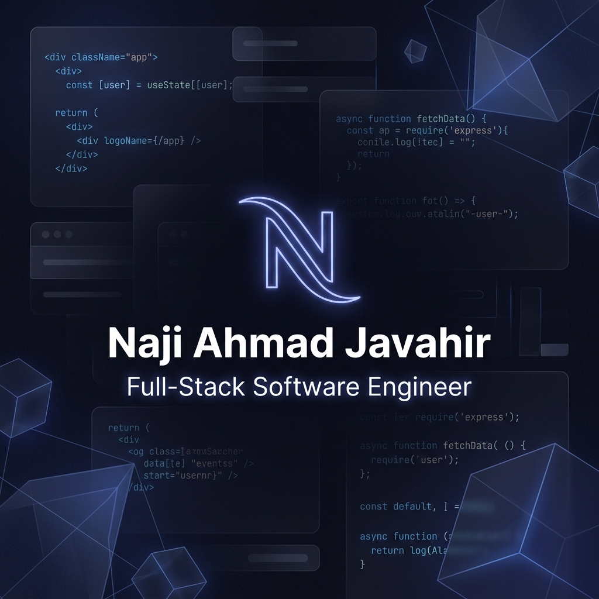

# 🚀 Modern Full-Stack Portfolio

A high-performance, interactive personal portfolio website built with a modern tech stack. This project features a cursor-reactive 3D hero section, dynamic project management via a custom CMS, and polished UI animations.



## 🛠️ Tech Stack

| Frontend | Backend | Design & Motion |
| :--- | :--- | :--- |
| React 18 | Node.js | Framer Motion |
| Vite | Express | Three.js (Fiber/Drei) |
| CSS3 (Vanilla) | MongoDB Atlas | Lucide Icons |

## ✨ Key Features

- **Interactive 3D UI:** Cursor-reactive particle systems and magnetic tilt effects.
- **Custom Admin Dashboard:** A separate CMS to manage projects, skills, and site settings without touching code.
- **Dynamic Project Showcase:** Problem → Solution modal flow with detailed system architecture visuals.
- **Automated Resume Handling:** Robust fallback system for production resume downloads.
- **Performance Optimized:** Achieving near-perfect Lighthouse scores through Vite's bundling.

## 🚀 Getting Started

1. **Clone the repo:**
   ```bash
   git clone https://github.com/NajiAhmad18/my-portfolio.git
   ```

2. **Install dependencies:**
   ```bash
   # Frontend
   cd my-portfolio && npm install
   
   # Backend
   cd ../server && npm install
   ```

3. **Run locally:**
   ```bash
   # Run both servers
   npm run dev
   ```

## 📄 License
MIT © [Naji Ahmad Javahir](https://github.com/NajiAhmad18)
